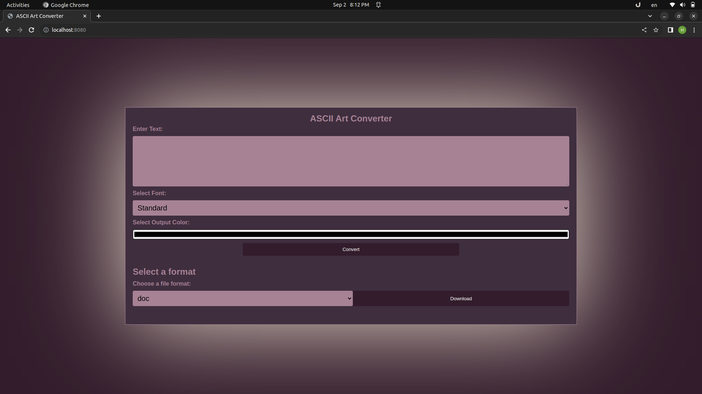

# ASCII Art Converter Web Application

Convert text into ASCII art with style! This web application allows you to enter text, choose a font style, and even select your preferred text color to generate beautiful ASCII art.



## Features

- **Text to ASCII Art Conversion**: Input any text, select a font style (standard, shadow, or thinkertoy), and choose a custom text color.

- **Output Display**: View the converted ASCII art in real-time with your chosen text color.

- **File Download**: Download your ASCII art as a text file (.txt) or a document file (.doc).

- **Error Handling**: The application provides clear error messages for invalid input or other issues.

- **Logging**: All user actions and errors are logged for troubleshooting.

- **Docker Support**: Easily containerize and deploy the application with Docker.

## Usage

1. Clone this repository to your local machine.

```bash
git clone https://github.com/your-username/ascii-art-converter.git
cd ascii-art-converter
```

2. Build and run the application using Docker.

```bash
docker build -t ascii-art-app .
docker run -p 8080:8080 ascii-art-app
```
or 
```bash
go run main.go
```

3. Access the application in your web browser at `http://localhost:8080`.

4. Enter the text you want to convert, choose a font style, and select a text color.

5. Click the "Convert" button to generate the ASCII art.

6. Optionally, choose to download the ASCII art as a text or document file.

## Dependencies

- Go (Golang): The application is written in Go.

- HTML Templates: HTML templates are used for rendering web pages.

- HTTP Server: Go's built-in HTTP server is used to serve web pages and handle requests.

- Docker: The application can be containerized and deployed using Docker.

## Maintainer

- Hussain Alboori 
- Hussain Nabeel
- Ali Alsanda

## Version

- Current version: 1.0

## License

This project is licensed under the [MIT License](LICENSE).